<div align="center">


</div>

<p align="center">
  
  
  <a href="https://github.com/DarkHeaVen1711?tab=followers"></a>
</p>

<p align="center">
  
</p>

<table align="center">
<tr>
<td valign="top" width="100%">

### 🦇 THE FILE

I am a 4th-year Computer Science & Engineering student specializing in AI/ML at **Adani University**. My work lives at the intersection of deep neural network architectures, behavioral fraud analytics, and high-performance full-stack development. I enjoy breaking down complex problems — whether optimizing sequence models or reverse-engineering systemic vulnerabilities. Gotham doesn't need a hero who sleeps on a clean codebase.

</td>
</tr>
</table>

<br>

<div align="center">

### 🏛️ LEADERSHIP & COMMUNITY IMPACT

</div>

<table align="center">
<tr>
<td>

```
┌──────────────────────────────────────────────────────────┐
│  VICE CHAIR                                              │
│  └── IEEE Student Branch, Adani University               │
│                                                          │
│  SECTION STUDENT REPRESENTATIVE (SSR)                    │
│  └── IEEE Gujarat Section                                │
│      (Outreach, Coordination & Membership Team)          │
└──────────────────────────────────────────────────────────┘
```

</td>
</tr>
</table>

<br>

<div align="center">

### 🚀 CASE FILES — FEATURED PROJECTS & RESEARCH

</div>

<table align="center" width="100%">
<tr>
<th>🗂️ Case</th>
<th>Briefing</th>
<th>Arsenal</th>
</tr>
<tr>
<td><b>ExoHabitNet</b><br><sub>Deep Learning Framework</sub></td>
<td>An original framework utilizing 1D-CNNs to process NASA transit light curves and identify potentially habitable worlds.</td>
<td><sub>Python · TensorFlow · NASA Transit Data</sub></td>
</tr>
<tr>
<td><b>Doubly Deep</b><br><sub>Research Architecture</sub></td>
<td>A multi-layered, context-aware framework built on a CNN-LSTM hybrid, optimized via SMOTE for precise UPI behavioral fraud detection.</td>
<td><sub>Python · PyTorch · Scikit-Learn · Behavioral Analytics</sub></td>
</tr>
<tr>
<td><b>DataViz</b><br><sub>Full-Stack Platform</sub></td>
<td>An interactive end-to-end data visualization platform supporting automated regression modeling and categorical analytics.</td>
<td><sub>React · Django · Next.js · TypeScript · Python</sub></td>
</tr>
</table>

<p align="center"><a href="https://github.com/DarkHeaVen1711?tab=repositories"></a></p>

<br>

<div align="center">

### 🛠️ THE UTILITY BELT

</div>

<table align="center">
<tr><td><b>Languages</b></td><td>


</td></tr>
<tr><td><b>Frontend & CMS</b></td><td>


</td></tr>
<tr><td><b>Backend & Enterprise</b></td><td>


</td></tr>
<tr><td><b>AI & Machine Learning</b></td><td>


</td></tr>
<tr><td><b>Data Analytics & BI</b></td><td>


</td></tr>
<tr><td><b>DevOps & Tools</b></td><td>


</td></tr>
<tr><td><b>Specialized Domains</b></td><td>
<sub>Behavioral Fraud Analytics • Medical Device Ecosystem Security • Neural Network Fine-Tuning</sub>
</td></tr>
</table>

<br>

<div align="center">

### 📊 THE FILE ON ME — GITHUB STATS

  
 

  


</div>

<br>

<div align="center">

### 📡 THE BAT-SIGNAL — LET'S CONNECT

<a href="https://www.linkedin.com/in/vyom-modh/"></a>
<a href="mailto:vyommodh0@gmail.com"></a>
<a href="https://github.com/DarkHeaVen1711"></a>

**Collaborating on:** Advanced full-stack ecosystems, complex ML pipelines, and original research writing.

**Ask me about:** Political Science & International Relations (PSIR) dynamics, mapping high-altitude trekking routes, building sequence models for anomaly detection, hunting rare pop-culture holographic stickers, or why the 2021 F1 season finale remains an absolute classic.

</div>

<br>

<p align="center">
  
</p>

<div align="center">
<i>"Whether navigating the quiet mountain peaks or the heaviest storms, the goal remains the same: quiet the internal noise, care deeply, and walk the path of fire."</i>
</div>

<br>

<div align="center">



</div>
